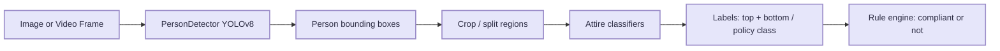

# Dress Code Compliance Detection

**Deep learning** project for **detecting people** in images or video and **classifying attire** toward automated dress-code checks (e.g. workplace or event policies). It uses convolutional and detection neural networks (YOLOv8, MobileNetV2) trained or fine-tuned on image data.

---

## Project description

This project explores an **end-to-end deep learning workflow** for dress compliance: localize individuals, analyze what they are wearing, and (in a full deployment) evaluate outcomes against configurable rules. The codebase combines a **deep object detector** (YOLOv8) with **transfer-learning CNNs** (MobileNetV2 and dedicated top/bottom garment models) so that policy logic can operate on predicted garment labels rather than raw pixels.

Motivation:

- Reduce manual review of entry or ID photos where dress code matters.
- Separate **perception** (detect person, infer garments) from **policy** (what combinations are allowed), so organizations can change rules without retraining detection models.

Current repository scope: modular **training and inference scripts** for deep-learning-based person detection, binary/multi-class attire training from folder-organized datasets, and a **top/bottom garment classifier interface**. A thin prediction demo shows person detection; wiring full compliance rules and a single CLI/UI entrypoint is outlined in [Roadmap](#roadmap).

---

## Table of contents

1. [Features](#features)
2. [Tech stack](#tech-stack)
3. [System overview](#system-overview)
4. [Repository structure](#repository-structure)
5. [Installation](#installation)
6. [Usage](#usage)
7. [Dataset](#dataset)
8. [Implementation notes](#implementation-notes)
9. [Roadmap](#roadmap)

---

## Features

| Area | Capability |
|------|------------|
| **Person detection** | YOLOv8-based bounding boxes; webcam or image; filters by confidence and minimum box size. |
| **Attire training** | MobileNetV2 fine-tuning with augmentations; stratified train/validation split; saves HDF5 model and training curves. |
| **Garment specialization** | Optional dual-head workflow: separate models for upper-body and lower-body crops with label maps (shirt, kurta, trouser, etc.). |
| **Demo inference** | Sample script to visualize detections on a still image. |

---

## Tech stack

- **Python 3**
- **OpenCV** — image I/O, visualization, cropping
- **Ultralytics YOLOv8** — person detection
- **TensorFlow / Keras** — MobileNetV2 transfer learning, model export (`.h5`)
- **scikit-learn** — label encoding, train/test split, metrics
- **NumPy**, **Matplotlib**, **imutils** — arrays, plots, image listing

---

## System overview

Intended data flow for a complete compliance product:



This repo ships building blocks for **A→E**; **G** is policy-specific and can be added as a small rules layer on top of predicted labels.

---

## Repository structure

| Path | Description |
|------|-------------|
| `detect_person.py` | `PersonDetector` class; loads `yolov8n.pt`; returns list of `(x1, y1, x2, y2)` boxes. |
| `dress_compliance_train.py` | Trains MobileNetV2 on `dataset/<class>/<images>`; writes `attire_3classifier.h5` and `training_plot2.png`. |
| `top_bottom_classifer.py` | `AttireClassifier`: loads `top_model.h5` and `bottom_model.h5`; 224×224 preprocessing; top/bottom label maps. |
| `dress_compliance_predict.py` | Demo: single image → draw person boxes (extend to call classifiers and rules as needed). |
| `requirements.txt` | Python dependencies for training and inference (install with `pip install -r requirements.txt`). |

---

## Installation

1. **Clone** this repository (or copy the project folder).

2. **Create a virtual environment** (recommended):

   ```bash
   python -m venv venv
   venv\Scripts\activate
   ```

3. **Install dependencies** (adjust TensorFlow build if you use GPU):

   ```bash
   pip install -r requirements.txt
   ```

4. **First run**: Ultralytics will download **`yolov8n.pt`** automatically if missing.

---

## Usage

Run commands from the project root (this directory).

### Person detection (webcam)

```bash
python detect_person.py
```

Press **`q`** to exit.

### Train attire classifier

1. Set **`DATASET_PATH`** in `dress_compliance_train.py` to your labeled image root.
2. Run:

   ```bash
   python dress_compliance_train.py
   ```

Outputs: model **`attire_3classifier.h5`**, plot **`training_plot2.png`**.

### Top / bottom classifier (requires trained weights)

Place **`top_model.h5`**, **`bottom_model.h5`**, and test images **`example_top.jpg`** / **`example_bottom.jpg`** next to the script, then:

```bash
python top_bottom_classifer.py
```

### Detection demo on a still image

Edit the image path inside **`dress_compliance_predict.py`**, then:

```bash
python dress_compliance_predict.py
```

---

## Dataset

Folder layout expected by **`dress_compliance_train.py`** (class name = parent directory):

```text
dataset/
├── casual/
│   └── *.jpg
└── formal/
    └── *.jpg
```

The training script currently uses a **binary** head (`Dense(2)`, `binary_crossentropy`). For **three or more** classes, add more subfolders and update the final `Dense` layer size and loss to **`categorical_crossentropy`** to match `to_categorical` outputs.

---

## Implementation notes

- **`dress_compliance_train.py`**: Replace hardcoded **`DATASET_PATH`** (and any local paths in predict scripts) when moving to another machine or publishing to GitHub.
- **`top_bottom_classifer.py`**: Filename uses **`classifer`**; import the module as `top_bottom_classifer`. Training scripts for `top_model.h5` / `bottom_model.h5` are not in this folder; add your own trainers or point to existing checkpoints.
- **`dress_compliance_predict.py`**: Currently demonstrates **person detection only**; connect **`AttireClassifier`** or the MobileNet checkpoint after cropping regions from each box for full attire inference.

---

## Roadmap

- [ ] Unified inference script: detect → crop → classify → optional rule engine.
- [ ] Config file or CLI arguments for paths, thresholds, and model filenames.
- [x] `requirements.txt` for reproducible installs (adjust versions for your CUDA/Python stack if needed).
- [ ] Optional Streamlit or FastAPI demo for portfolio demos.
- [ ] Train/export scripts for **`top_model.h5`** and **`bottom_model.h5`** in-repo.

---

## License

Specify your license here (for example MIT, Apache-2.0, or “All rights reserved”) when you publish the portfolio repo.

---

## Author

**Portfolio project** — Dress / attire compliance using deep learning. Update this section with your name, links, and contact as you prefer.
